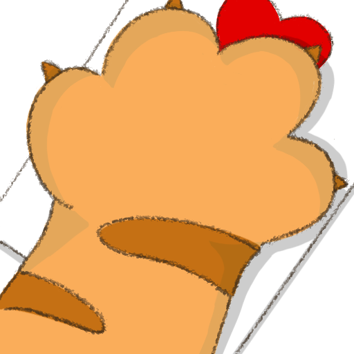
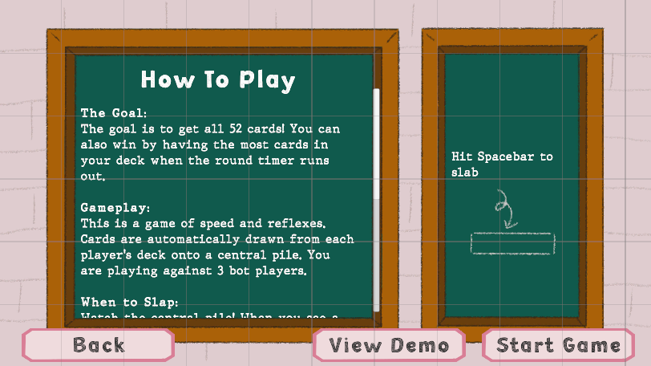
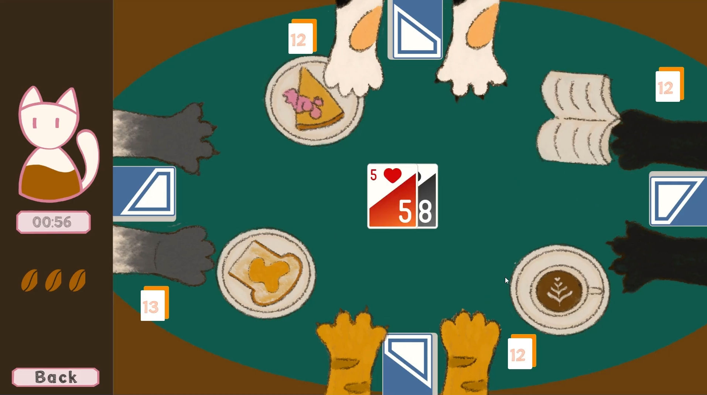
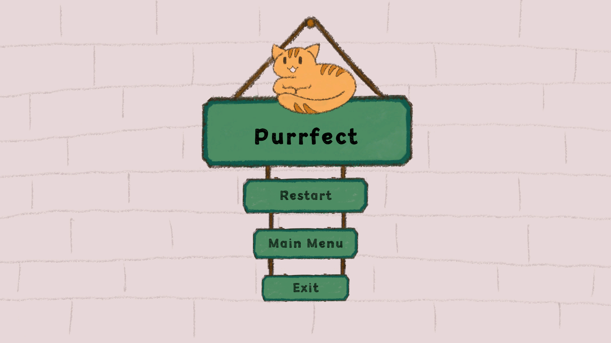

# SlapCard 🃏

*A fast-paced, reflex-based card game built in 48 hours for the Texas Game Jam 2025 – ATX Game Makers.*

## Gameplay Demo

  

  <em>Click the thumbnail to watch the gameplay video on YouTube!</em>

---

## How to Play

**The Goal:** Be the first to collect all 52 cards, or have the most cards in your deck when the timer runs out!

**Controls:** Press `Spacebar` to slap the central pile.

### When to Slap
This is a game of speed! Cards are automatically played onto a central pile. You are playing against 3 bot opponents. When you see one of the following conditions on the pile, be the first to slap:
* A **Jack**, **Queen**, or **King** appears.
* A **Pair** is formed (the top two cards have the same rank, like a 7 on a 7).

### Scoring
* ✅ **Correct Slap:** You win the entire central pile!
* ❌ **Incorrect Slap:** Be careful! A wrong slap will cost you one of your three lives.

## Features

* **Fast-Paced Gameplay:** Cards are played automatically, requiring constant focus and quick reflexes.
* **Challenging Bots:** Test your speed against three crafty bot opponents.
* **Multiple Win Conditions:** Win by dominating the deck or by having the most cards when the clock runs out.
* **Full Game Flow:** Complete with a main menu, instruction screen, and win/lose/draw end screens.

## Technology Stack

* **Engine:** Unity
* **Language:** C#
* **Platform:** WebGL (for browser-based play)

## The Team

This project was brought to life by a team of four developers and one designer.

* **Duy (Tony) Vu** - Project Lead, Gameplay Programmer
* **Tran Lam** - Gameplay Programmer
* **Uyen Tran** - Art & Animation
* **Quang Huy Le** - Sound Designer, Gameplay Programmer
* **Minh Nguyen** - UI Programmer

## Screenshots

  
  
   

## Play the Game 🎮  
[Click here to play PurrfectTiming on Unity WebGL](https://play.unity.com/en/games/d600a884-3007-4974-9770-5fe88f24d1eb/slapcardbuild)  

*Note: Best experienced on desktop with keyboard input.*
